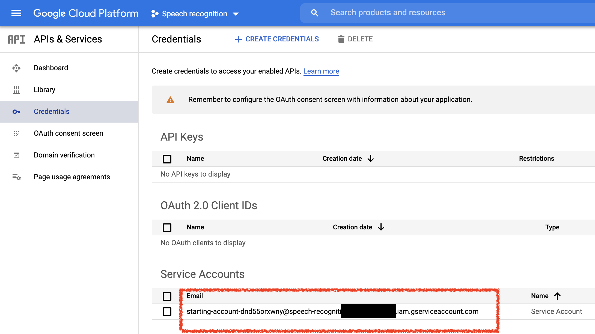
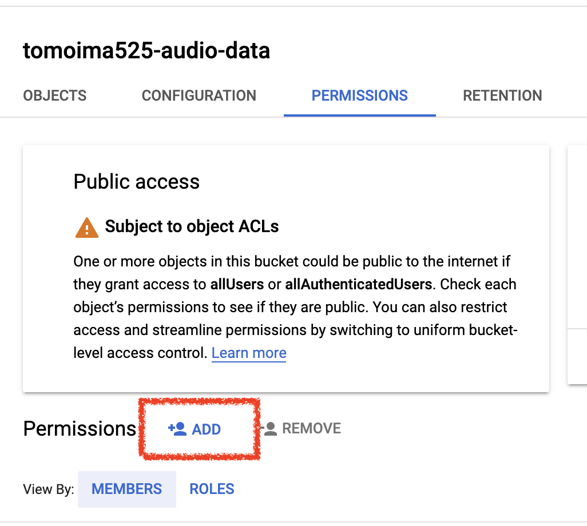
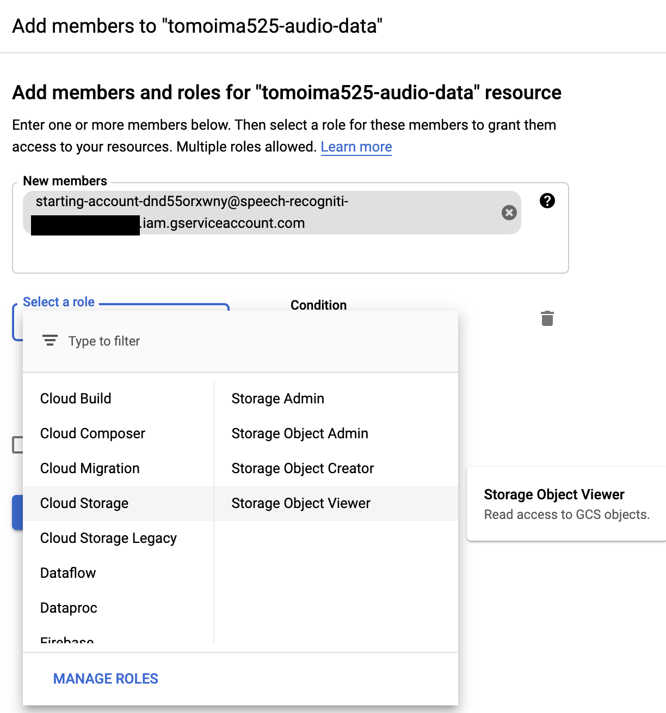
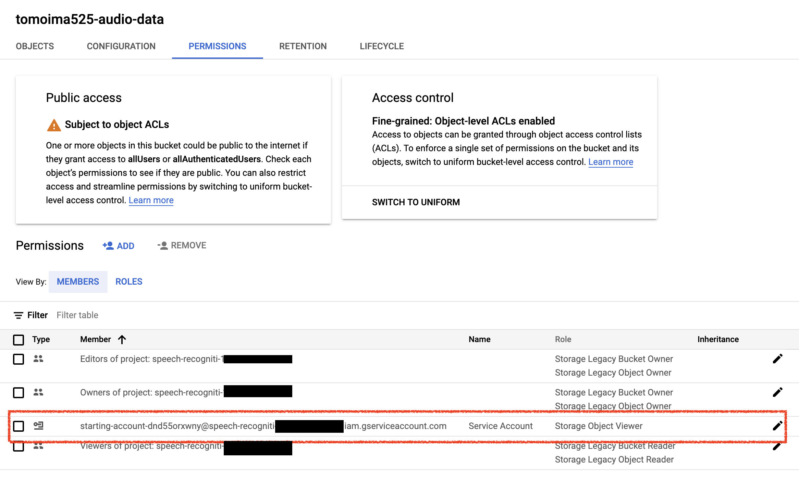

# Speech Recognition for Japanese audio

- Specified for Japanese audio

# How to use this
### Initialization

- Install dependencies
  ```
  yarn install
  ``` 

- Setup credential for Speech-to-Text
  - Create the credential file  https://cloud.google.com/speech-to-text/docs/quickstart-client-libraries#before-you-begin then set the path

  ```
  export GOOGLE_APPLICATION_CREDENTIALS='/path/to/your/credential.json'
  ```

### Google Storage setup (granting the permission)
You need to grant the permission to the service account of Speech-to-Text API to access Google Cloud Storage
- First check your service account's email address at Credential page on Google Cloud Platform
  
- Open Google Storage `https://console.cloud.google.com/storage` and locate to the directory where the source data is stored.
- Select Permission screen then select ADD Member
  
- Add the service account as Storage Object Viewer
   
- Check the account is added
  

### Execution
- Run the command below. URI should be either path to your Google Storage or the local path

  ```
  yarn start --uri 'gs://tomoima525-audio-data/test-data/today_i_learned_07_sample.flac'
  ```
